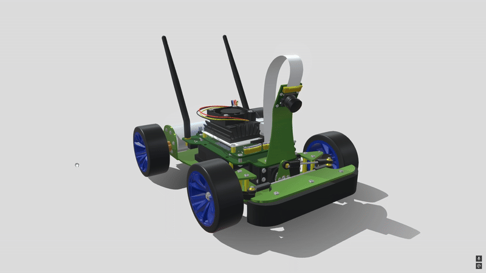

WRO 2025 FUTURE ENGINEERS - Astralis
# Astralis
Github for WRO.
Welcome to the official repository of **Team Astralis**, participants in the World Robot Olympiad (WRO) 2025 under the Future Engineers category.
Here you'll find the full development journey of our autonomous robot — from initial concepts to final deployment. This includes technical schematics, code,
component details, and documentation of the engineering process behind our robot.

---

## 📚 Table of Contents
- 👥 Meet the Team  
- 🎯 About the Challenge  
- 🤖 Robot Overview  
- ⚙️ Hardware Components  
- 🔧 Build and Assembly  
- 🛠️ Sensors & Power System  
- 💰 Budget Overview  
- 🛑 Obstacle Detection Strategy  
- 📦 Project Structure
- 🦅 Showcase
- 🙏 How to Build it for Yourself
---
👥 Meet the Team

**Robert Măntălau**  
Age: 14 
School:
Hello! I'm Robert from Romania,and this is my second WRO season in which i am competing. I have previously competed in Future Inoovators. I have a passion about making robots and programming.

**Dumitru Maximilian**
Age: 14
School:"Decebal" Theoretical School, Constanţa.
Hi! I am Maximilian from Romania, and this is my second season i am compeating in, previously competing in Future Innovators.
I have competed in many other competitons such as this one. I am passionate about Robotics and electronics.

**Edi Haivas**  
Age: 14  
School:
Hi! My name is Edi from Romania, and this is my second WRO season, previously participating the Future Innovators Category.
Iam passionate about Robotics, Coding, and Technology.

We are a team of young robotics enthusiasts with a passion for engineering, coding, and autonomous systems. This is our WRO 2025 project,
and we're excited to showcase our work in the Future Engineers category.

---
## 🎯 Challenge Overview

The WRO 2025 Future Engineers challenge requires us to develop an autonomous vehicle capable of navigating a dynamic, randomized racetrack using sensors and intelligent control systems. Our robot must:

- Complete multiple laps while detecting and responding to traffic signs.
- Perform a precise parallel parking maneuver at the end.

---
## ⚙️ Components

- Dual-Mode Wireless NIC
  
  
  
- Metal Gear Steering Servo

  
  
- Dual High Power Metal Motor
  
  

- Battery holder

  
- Sony IMX219 Sensor

  

  
- High Quality Non-Skid Tire

  

  
- NVIDIA Jetson Nano

  

---
## 🔧 Assembly Process

This section will detail our robot's mechanical assembly steps, including:

- Chassis preparation  
- Mounting motors and electronics  
- Cable management and layout  
- Power distribution setup

---
## 💰 Budget Overview

We’ve documented all hardware costs to ensure transparency and reproducibility. The breakdown includes electronics, structural parts, and 3D printing material.
---
## 🛑 Obstacle Management

Our robot uses computer vision to detect red and green signs:

- 🟥 Red: Stay on the right
- 🟩 Green: Stay on the left

The logic adjusts the robot’s path in real time based on the color signals detected via camera input.
---
## 📦 Project Structure

## How to Build it for Yourself
Simply go into **[src/code.ipnyb](src/code.ipnyb)** then upload it to your jetson's jupyter lab
# Model Used

# Showcase
Watch our robot in action:  
**[resources/media/showcase.mp4](resources/medila/showcase.mp4)**
